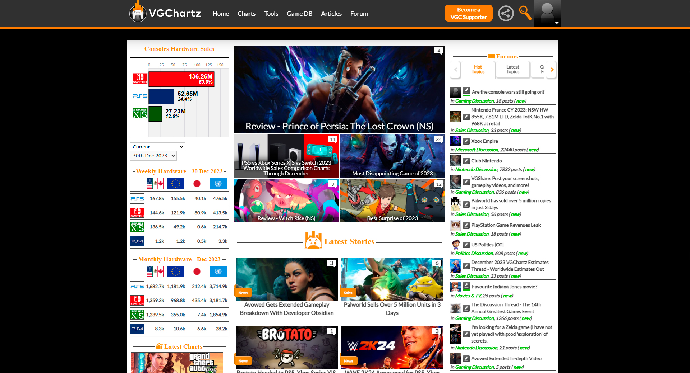
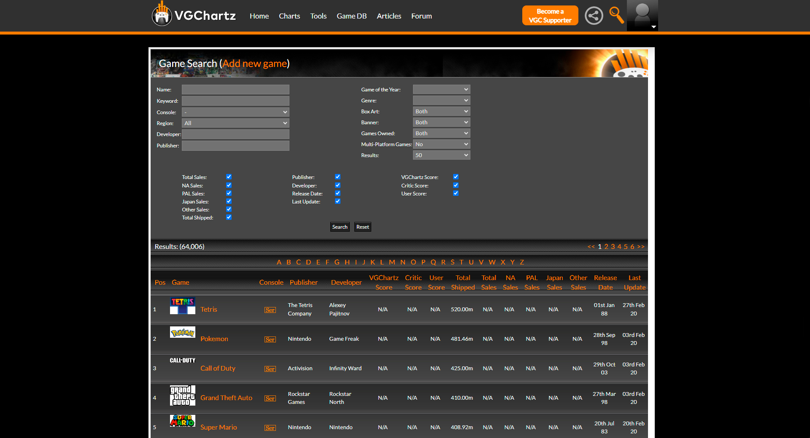

# Описание данных

Данные собраны и систематизированы с помощью программы с сайта 
[VGChartz.com](https://www.vgchartz.com) (см. [сбор данных](parsing.md)).

## О сайте VGChartz.com:

"Компания **VGChartz (Video Game Charts)**, основанная в 2005 году 
Бреттом Уолтоном, является фирмой по бизнес-аналитике и исследованиям, 
а также издателем веб-сайтов **VGChartz.com**. 
Как отраслевая исследовательская фирма, VGChartz каждую неделю публикует оценки 
оборудования для видеоигр и размещает постоянно расширяющуюся базу данных игр, 
в которой содержится более 55 000 наименований, содержащая актуальную информацию 
о поставках и устаревшие данные о продажах. Веб-сайт VGChartz.com предоставляет 
потребителям разнообразный контент: от новостей и продаж до обзоров и статей, 
социальных сетей и форумов сообщества". - с сайта 
**[VGChartz.com](https://www.vgchartz.com)**.

**Методология сбора данных**:
С конца 2018 года VGChartz больше не составляет оценки продаж программного 
обеспечения. Это связано с тем, что высокая доля цифрового рынка программного 
обеспечения затрудняла получение надежных розничных оценок, а также делала эти 
оценки все более нерепрезентативными для более широкой производительности 
рассматриваемых игр. В результате, что касается программного обеспечения, 
мы теперь записываем только официальные данные об отгрузках/продажах, 
если такие данные предоставляются разработчиками и издателями. 
Устаревшие данные остаются на сайте для тех, 
кто заинтересован в их просмотре.- с сайта 
**[VGChartz.com](https://www.vgchartz.com)**.

## Описание полей

Данные содержат следующие поля:
1. **name** - название;
2. **date** - дата выхода;
3. **platform** - игровая платформа;
4. **publisher** - издатель;
5. **developers** - разработчик;
6. **shipped** - количество отданных копий;
7. **total** - общее количество проданных копий;
8. **america** - количество проданных копий в Америке;
9. **europe** - количество проданных копий в Европе;
10. **japan** - количество проданных копий в Японии;
11. **other** - остальные продажи в мире;
12. **vgc** - оценка VGChartz.com;
13. **critic** - оценка критиков;
14. **user** - оценка пользователей.

[К описанию проекта](../README.md)
