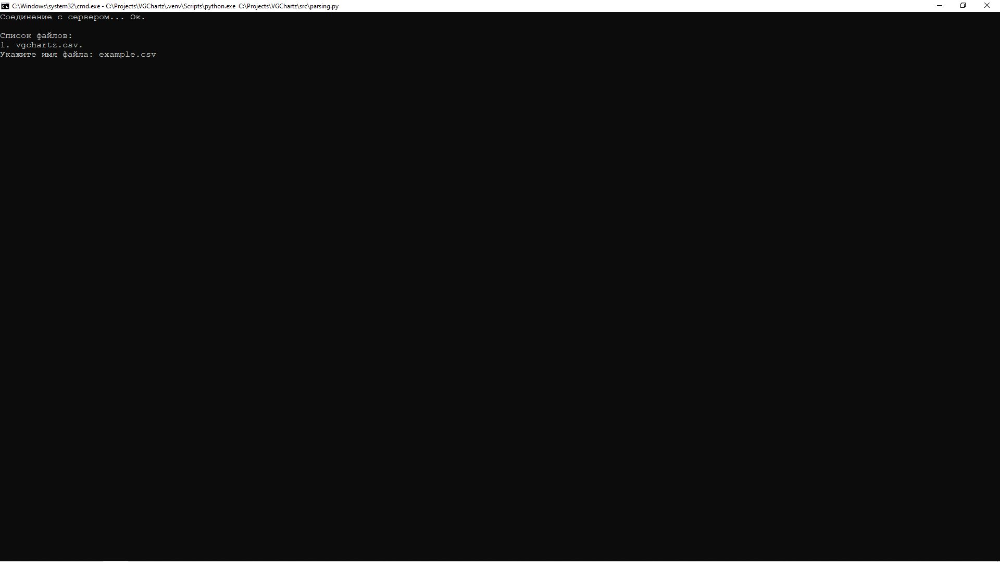
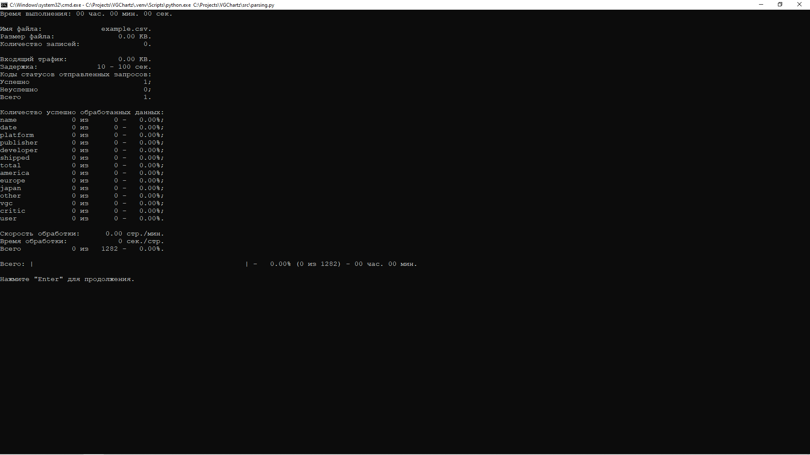
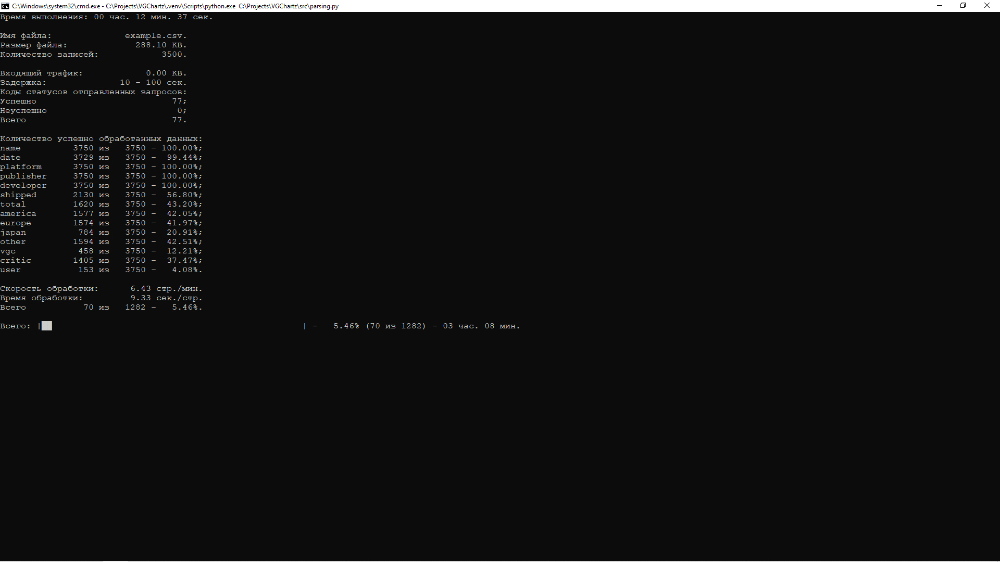
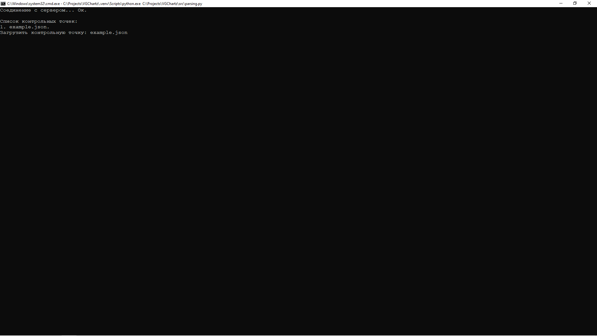
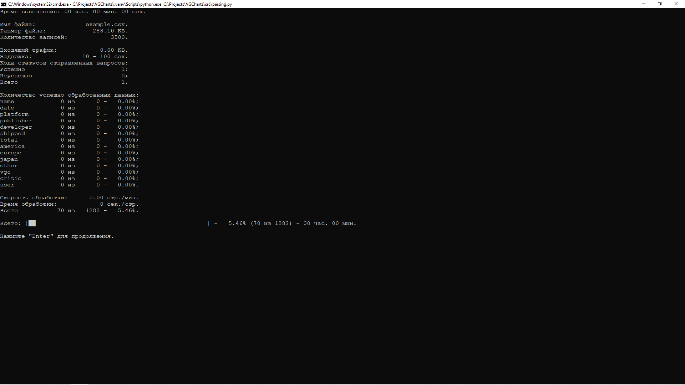

# Сбор данных

Точка входа для сбора данных с сайта [VGChartz.com](https://www.vgchartz.com) 
находится в файле [parsing.py](../src/parsing.py):

```python
import asyncio
import os

from config.parser.parser import SETTINGS
from config.paths import CHECKPOINT_PATH
from config.paths import FILE_RAW_PATH
from parser.parser import Parser
from utils.explorer import explorer


async def main():
    """
        Тока входа сбора данных;

        :return: None.
        """

    parser = Parser()

    os.system('cls')
    print('Соединение с сервером...', end=' ', flush=True)

    if code := await parser.connect() == 200:
        print('Ок.', flush=True)

        if names := explorer(CHECKPOINT_PATH, '*.json'):
            print(flush=True)
            print('Список контрольных точек:', names, sep='\n', flush=True)
            if checkpoint := input('Загрузить контрольную точку: '):
                await parser.load(checkpoint)
            else:
                print(flush=True)
                names = explorer(FILE_RAW_PATH, '*.csv')
                print('Список файлов:', names, sep='\n', flush=True)
                data = input('Укажите имя файла: ')

                settings = {}
                settings |= SETTINGS
                settings |= {'file': data}
                settings |= {'checkpoint': data.split('.')[0] + '.json'}
                await parser.setting(**settings)
        else:
            print(flush=True)
            names = explorer(FILE_RAW_PATH, '*.csv')
            print('Список файлов:', names, sep='\n', flush=True)
            data = input('Укажите имя файла: ')

            settings = {}
            settings |= SETTINGS
            settings |= {'file': data}
            settings |= {'checkpoint': data.split('.')[0] + '.json'}
            await parser.setting(**settings)

        await parser.state()

        print(flush=True)
        if not input('Нажмите "Enter" для продолжения.'):
            await parser.scrape()

    else:
        print(f'Неудача (код {code}).', end='\n\n', flush=True)

    await parser.disconnect()

if __name__ == '__main__':
    asyncio.run(main())
```

Файл состоит из определения функции `main`, 
которая передается в функцию `asyncio.run`, 
так как программа исполняется в асинхронном режиме.

## Начало сбора данных

Чтобы начать сбор данных, необходимо запустить файл [parsing.py](../src/parsing.py). 
После запуска, программа соединится с сервером, после чего, 
пользователю будет предложено указать имя файла с расширением `*.csv`. 
Перед этим будет выведен список файлов, имеющихся в папке [raw](../data/raw).
В данной папке будут храниться файлы, собранные с помощью программы и 
непрошедшие [предварительную обработку](preprocessing.md). 



>Обратите внимание, если вы ранее осуществляли сбор данных 
>и не завершили его до конца, вероятнее всего, в папке 
>[checkpoints](../data/raw/checkpoints) находится файл контрольной точки, 
>тогда перед предложением указать имя файла с расширением `*.csv` 
>будет предложено выбрать файл контрольной точки с расширением `.json`
>для возобновления процесса сбора данных 
>(см. [Возобновление сбора данных](#возобновление-сбора-данных)). 
>Чтобы, пропустить выбор контрольной точки, нажмите клавишу "Enter".

>Если вы укажите имя существующего файла, то все данные, находящиеся в нем, 
>будут перезаписаны.

После ввода имени файла, через некоторое время (программе необходимо получить 
объем страниц, находящихся на сервере), появится текущее состояние, 
которое будет отслеживаться в процессе сбора данных.



Нажмите клавишу "Enter", чтобы начать сбор данных. 
Процесс сбора данных будет выглядеть следующим образом.



## Возобновление сбора данных

Процесс сбора данных может быть прерван случайно, например, 
из-за неустойчивого интернет-соединения. 
Вы можете не беспокоится за потерю собранных данных, 
программа сохраняет свое текущее состояние после обработки каждой страницы 
в файл с расширением `*.json` в каталоге [checkpoints](../data/raw/checkpoints).

Процесс сбора данных может занимать несколько суток 
и вы можете прервать процесс в любой момент времени. 
При следующем запуске, программа обнаружит наличие файла (нескольких файлов) 
с расширением `*.json` в каталоге [checkpoints](../data/raw/checkpoints) 
и предложит выбрать один из них, 
чтобы продолжить сбор данных с контрольной точки.



Выберете один из файлов контрольной точки и вы увидите то состояние, 
в котором находилась программа в момент создания контрольной точки.



Нажмите клавишу "Enter", чтобы продолжить сбор данных.

[К описанию проекта](../README.md)