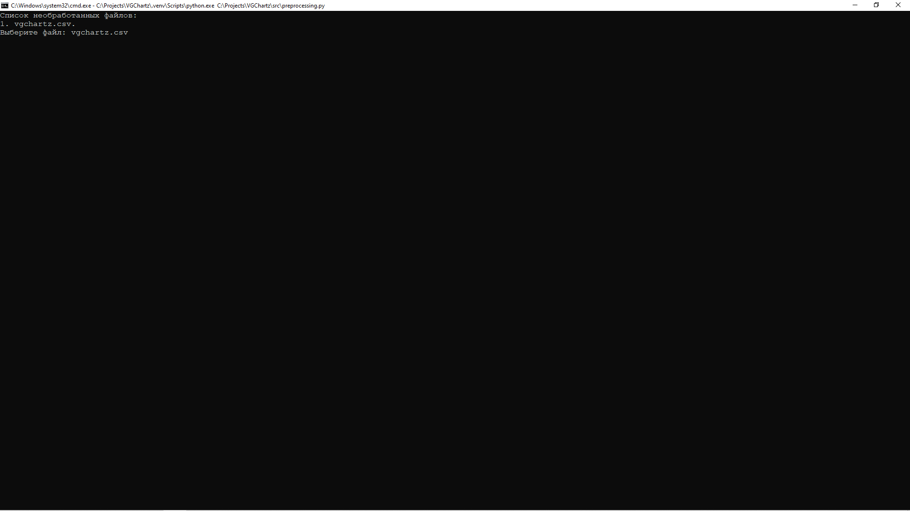

# Предварительная обработка данных

Точка входа для предварительной обработки данных находится в файле 
[preprocessing.py](../src/preprocessing.py):

```python
import os

import pandas as pd

from config.paths import FILE_PREPROCESSED_PATH
from config.paths import FILE_RAW_PATH
from utils.data import prepare
from utils.explorer import explorer


def main():
    """
    Тока входа предварительной обработки данных;

    :return: None.
    """

    names = explorer(FILE_RAW_PATH, '*.csv')
    os.system('cls')
    print('Список необработанных файлов:', names, sep='\n', flush=True)

    if name := input('Выберите файл: '):
        name = name.split('.')[0]
        data = pd.read_csv(f'{FILE_RAW_PATH}/{name}.csv')

        # Подготовка к предварительно обработке данных.
        data = prepare(data)

        # Сохранение предобработанных данных.
        data.to_csv(
            path_or_buf=fr'{FILE_PREPROCESSED_PATH}\{name}.csv',
            sep=',',
            index=False
        )


if __name__ == '__main__':
    main()
```

На данном этапе:
- удаляются явные дубликаты;
- удаляются записи, которые в поле platform имеют значения "All" или "Series";
- заменяются значение Unknown в поле "developer" и "publisher" на NaN;

Чтобы начать процесс предварительной обработки данных, 
необходимо запустить данный файл. Программа отобразит содержимое директории 
[raw](../data/raw), где хранятся файлы, 
сформированные на этапе сбора данных (см. [сбор данных](parsing.md)).



После предварительной обработки данных, 
в директории [processed](../data/processed) появится файл с данными в формате `.csv`. 
Название файла будет совпадать с названием файла в каталоге 
[raw](../data/raw).

>Обратите внимание, файлы из директории [raw](../data/raw) не удаляются.

[К описанию проекта](../README.md)
