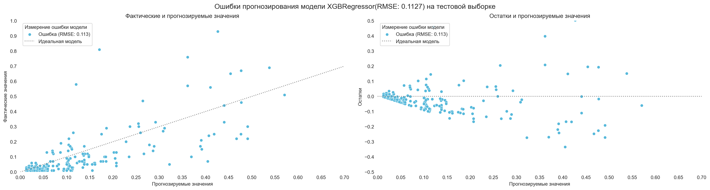

# Тренировка и оценка моделей

Точка входа тренировки моделей находится в файле 
[training.py](../src/training.py):

```python
import os

import pandas as pd

from config.paths import FILE_PREPROCESSED_PATH
from config.paths import MODELS_PATH
from ml.training import train
from utils.explorer import explorer


def main():
    """
    Тока входа тренировки моделей на предварительно обработанных данных;

    :return: None.
    """

    names = explorer(FILE_PREPROCESSED_PATH, '*.csv')
    os.system('cls')
    print('Список предобработанных файлов:', names,
          sep='\n',
          flush=True)

    if name := input('Выберите файл: '):
        data = pd.read_csv(f'{FILE_PREPROCESSED_PATH}/{name}')

        models = {}

        print(flush=True)
        names = explorer(path=MODELS_PATH,
                         ext='*.py',
                         exclude=('__init__.py', 'model.py'))
        print('Список файлов c моделями:', names, sep='\n', flush=True)

        if files := input('Выберите один или несколько файлов: '):
            for file in files.split():
                name = file.split('.')[0]

                modul = __import__(
                    name=f'ml.models.{name}',
                    globals=globals(),
                    locals=locals(),
                    fromlist=['model'],
                    level=0
                )

                models[name] = modul.model

        train(
            models=models,
            data=data,
            n_trials=250
        )


if __name__ == '__main__':
    main()
```

## Тренировка моделей

Чтобы начать процесс тренировки моделей, необходимо запустить данный файл. 
Программа отобразит содержимое каталога [processed](../data/processed), 
где хранятся файлы, сформированные на этапе предварительной обработки данных 
(см. [Предварительная обработка данных](preprocessing.md)). Необходимо выбрать файл 
с данными, на которых модель будет обучаться.


После выбора данных, на которых будет проводиться тренировка, 
необходимо выбрать одну или несколько моделей. 


Все модели должны располагаться в каталоге [models](../src/ml/models), 
с расширением `*.py` и содержать экземпляр класса `Model` 
в котором содержатся:
1. model: pipeline модели;
2. name: название модели, которое будет отображаться на графиках;
3. params: пространство гиперпараметров, подбор которых будет осуществляться 
с помощью пакета [Optuna](https://optuna.org).
4. metric: функция оценки модели на тестовой выборке.
5. scoring: функция оценки модели во время кросс валидации.
6. cv: метод кросс валидации.

```python
from lightgbm import LGBMRegressor
from sklearn.compose import ColumnTransformer
from sklearn.metrics import make_scorer
from sklearn.metrics import root_mean_squared_error
from sklearn.model_selection import TimeSeriesSplit
from sklearn.pipeline import Pipeline
from sklearn.preprocessing import TargetEncoder

from config.ml import CV_N_SPLITS
from config.ml import CV_TEST_SIZE
from config.ml import CV_TRAIN_SIZE
from config.ml import RANDOM_STATE

from .model import Model


category = [
    'platform',
    'publisher',
    'developer',
    'america',
    'europe',
    'japan',
    'other'
]

encoder = TargetEncoder(
    random_state=RANDOM_STATE
)

standardizer = ColumnTransformer(
    transformers=[
        ('encoder', encoder, category)
    ],
    remainder='passthrough'
)


estimator = LGBMRegressor(
    random_state=RANDOM_STATE,
    verbosity=-1
)

pipeline = Pipeline(
    steps=[
        ('standardizer', standardizer),
        ('estimator', estimator),
    ]
)

params = {
    'estimator__learning_rate': ['float', {'low': 0.1,
                                           'high': 1.0,
                                           'step': 0.05}],
    'estimator__max_depth': ['int', {'low': 1,
                                     'high': 50,
                                     'step': 1}],
    'estimator__n_estimators': ['int', {'low': 50,
                                        'high': 500,
                                        'step': 50}],
    'estimator__num_leaves': ['int', {'low': 2,
                                      'high': 50,
                                      'step': 2}],
    'estimator__reg_alpha': ['float', {'low': 0.0,
                                       'high': 1.0,
                                       'step': 0.05}],
    'estimator__reg_lambda': ['float', {'low': 0.0,
                                        'high': 1.0,
                                        'step': 0.05}],
}

scoring = make_scorer(
    score_func=root_mean_squared_error
)

cv = TimeSeriesSplit(
    n_splits=CV_N_SPLITS,
    max_train_size=CV_TRAIN_SIZE,
    test_size=CV_TEST_SIZE
)


model = Model(
    pipeline=pipeline,
    name='LGBMRegressor',
    params=params,
    metric=root_mean_squared_error,
    scoring=scoring,
    cv=cv
)
```

Количество испытаний можно задать с помощью параметра `n_trials`. Обычно хватает 
200-300 испытаний для нахождения оптимальных гиперпараметров.

```python
train(
    models=models,
    data=data,
    n_trials=250
)
```

Изменить структуру и формат отображения прогресса обучения моделей, можно в 
файле [verbose.py](../src/utils/ml/verbose.py), путем модификации метода 
`__call__` класса `Verbose`:

```python
def __call__(self, study: Study, trial: FrozenTrial):
    index = trial.number + 1
    state = trial.state.name
    complete = (trial
                .datetime_complete
                .strftime('%d-%m-%Y %H:%M:%S'))
    seconds = (trial.datetime_complete - trial.datetime_start).seconds
    minutes = seconds // 60
    seconds = seconds % 60
    value = round(trial.values[0], 4)
    best = round(study.best_value, 4)

    print(f'{self.name}: [{complete}] - [{minutes:02}:{seconds:02}] - '
          f'{state}: {index}/{self.trials} - {value:.4f} ({best:.4f}).')
```

## Оценка моделей

После завершения обучения, в каталоге [models](../models) 
будет создан каталог с названием файла модели, 
указанного перед началом тренировки. В каталоге будут находиться файлы:
- файл тренированной модели с расширением `*.joblib`, 
имя которого будет совпадать с названием файла модели, 
указанного перед началом тренировки.

В каталоге [training](../reports/training) будет создан каталог 
с названием файла модели, указанного перед началом тренировки. 
В папке будут находиться: 
1. Файл `best_params.json` - гиперпараметры модели, 
при которых предсказательная способность модели была наилучшей.
2. Файл `cv_results.csv` - результаты кросс-валидации.
3. Каталог `images` - графические материалы.

В каталоге `images` будут содержаться следующие файлы:
- `scalability.png` - масштабируемость модели;
- `error.png` - ошибки прогнозирования регрессионной модели.
- `dummy.png` - ошибки прогнозирования простой эмпирической модели.

Примеры графических материалов, сформированных по результатам тренировки модели:





[К описанию проекта](../README.md)