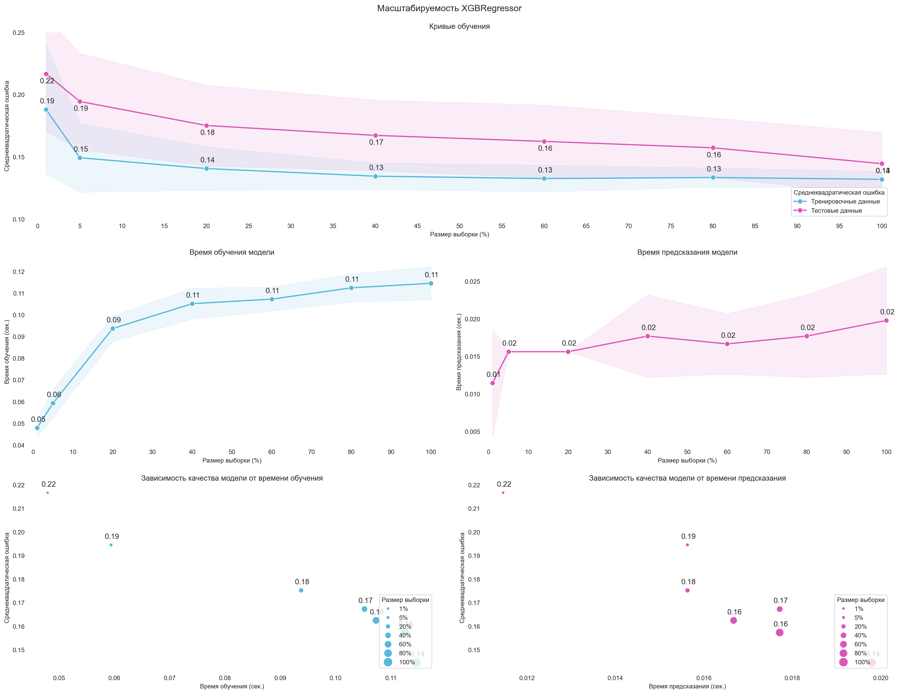

# Тренировка и оценка моделей

Точка входа тренировки моделей находится в файле 
[training.py](../src/training.py):

```python
import os

from config.paths import FILE_PREPROCESSED_PATH
from config.paths import MODELS_PATH
from ml.training import train
from utils.explorer import explorer


def main():
    """
    Тока входа тренировки моделей на предварительно обработанных данных;

    :return: None.
    """

    names = explorer(FILE_PREPROCESSED_PATH, '*.csv')
    os.system('cls')
    print('Список предобработанных файлов:', names, sep='\n', flush=True)

    if data := input('Выберите файл: '):
        models = []

        print(flush=True)
        names = explorer(MODELS_PATH, '*.py')
        print('Список файлов c моделями:', names, sep='\n', flush=True)

        if files := input('Выберите один или несколько файлов: '):
            for file in files.split():
                name = file.split('.')[0]

                modul = __import__(
                    name=f'training.models.{name}',
                    globals=globals(),
                    locals=locals(),
                    fromlist=['title', 'model', 'params'],
                    level=0
                )

                models.append(
                    {
                        'name': name,
                        'title': modul.title,
                        'model': modul.model,
                        'params': modul.params,
                    }
                )

        train(file=data, models=models)


if __name__ == '__main__':
    main()
```

## Тренировка моделей

Чтобы начать процесс тренировки моделей, необходимо запустить данный файл. 
Программа отобразит содержимое каталога [processed](../data/processed), 
где хранятся файлы, сформированные на этапе предварительной обработки данных 
(см. [Предварительная обработка данных](preprocessing.md)).


После выбора данных, на которых будет проводиться тренировка, 
необходимо выбрать одну или несколько моделей. 


Все модели должны располагаться в каталоге [models](../src/ml/models), 
с расширением `*.py` и иметь следующее содержимое:
1. title - заголовок, который будет использован при построении отчетов.
2. model - модель машинного обучения.
3. params - гиперпараметры модели.

```python
import numpy as np

from sklearn.compose import ColumnTransformer
from sklearn.ensemble import RandomForestRegressor
from sklearn.pipeline import Pipeline
from sklearn.preprocessing import TargetEncoder

from config.ml import RANDOM_STATE


title = 'RandomForestRegressor'

category = [
    'platform',
    'publisher',
    'developer',
    'america',
    'europe',
    'japan',
    'other'
]

encoder = TargetEncoder(
    random_state=RANDOM_STATE
)

standardizer = ColumnTransformer(
    transformers=[
        ('encoder', encoder, category)
    ],
    remainder='passthrough'
)


estimator = RandomForestRegressor(
    random_state=RANDOM_STATE
)

model = Pipeline(
    steps=[
        ('standardizer', standardizer),
        ('estimator', estimator),
    ]
)

params = {
    'estimator__max_depth': np.arange(
        start=2,
        stop=21
    ).tolist(),
    'estimator__min_samples_split': np.arange(
        start=2,
        stop=11,
        step=2
    ).tolist(),
    'estimator__min_samples_leaf': np.arange(
        start=1,
        stop=10,
        step=2
    ).tolist()
}
```

## Оценка моделей

После завершения обучения, в каталоге [models](../models) 
будет создан каталог с названием файла модели, 
указанного перед началом тренировки. В каталоге будут находиться файлы:
- файл тренированной модели с расширением `*.joblib`, 
имя которого будет совпадать с названием файла модели, 
указанного перед началом тренировки.

В каталоге [training](../reports/training) будет создан каталог 
с названием файла модели, указанного перед началом тренировки. 
В папке будут находиться: 
1. Файл `best_params.json` - гиперпараметры модели, 
при которых предсказательная способность модели была наилучшей.
2. Файл `cv_results.csv` - результаты кросс-валидации.
3. Каталог `images` - графические материалы.

В каталоге `images` будут содержаться следующие файлы:
- `scalability.png` - масштабируемость модели;
- `error.png` - ошибки прогнозирования регрессионной модели.

Примеры графических материалов, сформированных по результатам тренировки модели:




[К описанию проекта](../README.md)